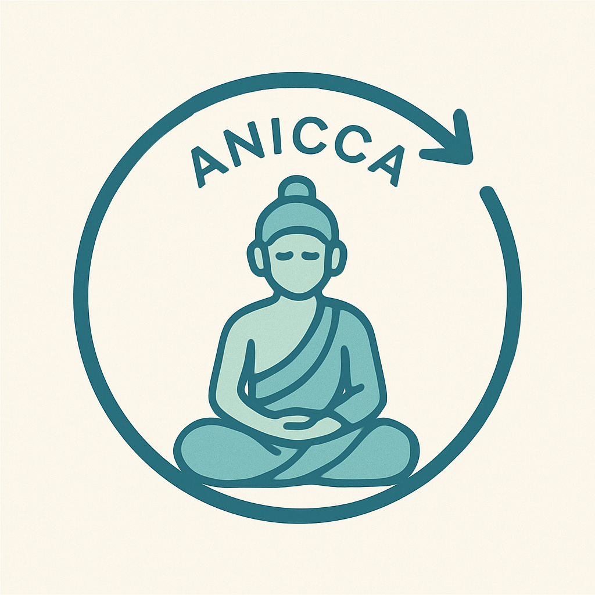

# MeditationTrackerBot 🧘‍♂️

A bilingual Telegram meditation tracking bot built on Google Apps Script that helps users track their daily meditation sessions, provides detailed analytics, and sends automated daily reminders.



## Features

### 🌍 Bilingual Support

- **English** and **Spanish** interface
- Automatic language detection based on commands
- Consistent bilingual responses and analytics

### 📊 Meditation Tracking

- **Morning Sessions** (`/morning` / `/mañana`) - Track AM meditation
- **Evening Sessions** (`/evening` / `/tarde`) - Track PM meditation
- Automatic timestamp recording
- User session history storage
- Duplicate session prevention

### 📈 Analytics & Reports

- **Personal Status** (`/status` / `/estado`) - Individual progress overview with visual progress bars
- **General Analysis** (`/analysis` / `/analisis`) - Community-wide statistics with visual progress bars
- **Personal Analysis** (`/myanalysis` / `/mianalisis`) - Detailed personal insights with visual progress bars
- Completion rates and consistency tracking
- User participation statistics
- Visual progress bars for all analytics commands

### 🎨 Enhanced Visual Interface

- **Dot-based Progress Bars**: Visual representation using filled (●) and empty (○) dots
- **Consistent Formatting**: Icon → Progress Bar → Percentage → Category Name → User List
- **Full-width Completion Bars**: Enhanced visibility for overall completion rates
- **Clean User Display**: Simple, readable username and name lists
- **Bilingual Visual Elements**: Consistent formatting across English and Spanish interfaces

### 🔔 Automated Reminders

- **Daily morning reminders** at 8:00 AM 🌞
- **Daily evening reminders** at 8:00 PM 🌙
- Sent to all registered chats automatically
- Customizable timing via Google Apps Script triggers

### 🔐 User Management

- Registration system via `/start` command
- Telegram user ID-based tracking (privacy-safe)
- Chat ID registration for group reminders
- Duplicate registration prevention
- Unregistered user handling

## Commands

| English       | Spanish       | Description                      |
| ------------- | ------------- | -------------------------------- |
| `/start`      | `/start`      | Register with the bot            |
| `/help`       | `/ayuda`      | Show available commands          |
| `/morning`    | `/mañana`     | Log morning meditation session   |
| `/evening`    | `/tarde`      | Log evening meditation session   |
| `/status`     | `/estado`     | View your meditation statistics  |
| `/analysis`   | `/analisis`   | View community analytics         |
| `/myanalysis` | `/mianalisis` | View detailed personal analytics |

## Example Output

### Status Command (`/status`)

```
📊 Status (2025-01-07)
👥 Total: 6

🏆 ●○○○○○○○○○ 17% Both sessions
Kenia

🌞 ●○○○○○○○○○ 17% Morning only
@SimpleMentesLibres

🌙 ●●●●●○○○○○ 50% Evening only
7 lunas, @AVERON9124, @ToniPedragosa

⏳ ●○○○○○○○○○ 17% Pending
@LuNiPriSe

📈 Today's completion rate
●●●●●●●●●●○○○○○○○○○○ 50%
```

### Analysis Command (`/analysis`)

```
📊 Overall Meditation Analysis

Total Participants (all-time): 6
Total User-Days Tracked: 42

Session Distribution (per user per day):
🏆 ●●○○○○○○○○ 17% Both Sessions
🌞 ●●○○○○○○○○ 17% Morning Only
🌙 ●●●●●○○○○○ 50% Evening Only
⏳ ●●○○○○○○○○ 17% No Sessions

📈 Overall Completion Rate
●●●●●●●●●●●○○○○○○○○○ 57%
```

## Setup Instructions

### Prerequisites

1. **Telegram Bot**: Create via [@BotFather](https://t.me/botfather) on Telegram
2. **Google Account**: Access to [Google Apps Script](https://script.google.com)
3. **Google Sheets**: Document for data storage via [Google Sheets](https://sheets.google.com)

### Step 1: Create Google Sheets Document

1. Go to [Google Sheets](https://sheets.google.com)
2. Create a new spreadsheet
3. **Copy the Sheet ID** from the URL:
   ```
   https://docs.google.com/spreadsheets/d/[SHEET_ID]/edit
   ```
   Example: `1ABC123def456GHI789jkl012MNO345pqr678STU901vwx234YZ`

### Step 2: Configure Google Apps Script

1. Go to [Google Apps Script](https://script.google.com)
2. Create a new project
3. Replace the default code with `MeditationTrackerBot.js`
4. **Configure the constants** at the top of the script:
   ```javascript
   const TELEGRAM_BOT_TOKEN = "YOUR_BOT_TOKEN_FROM_BOTFATHER";
   const SHEET_ID = "YOUR_GOOGLE_SHEETS_ID_FROM_STEP_1";
   ```

### Step 3: Run Setup Functions

Execute these functions in Google Apps Script (Run > Function):

1. **`setupSheet()`** - Creates proper column headers in your Google Sheet:

   - Date, User ID, Username, Morning Time, Evening Time

2. **`setupReminders()`** - Configures automated daily reminders:
   - Morning reminder at 8:00 AM
   - Evening reminder at 8:00 PM
   - Automatically sends to all registered chats

### Step 4: Deploy the Bot

1. In Google Apps Script: **Deploy > New deployment**
2. Type: **Web app**
3. Execute as: **Me**
4. Who has access: **Anyone**
5. Copy the **Web app URL**

### Step 5: Set Telegram Webhook

Use this URL (replace with your details):

```
https://api.telegram.org/bot[YOUR_BOT_TOKEN]/setWebhook?url=[YOUR_WEB_APP_URL]
```

### Optional: Maintenance Functions

- **`cleanupDuplicateRows()`** - Remove duplicate entries (run once if needed)

## Technical Architecture

### Google Apps Script Integration

- Built entirely on [Google Apps Script](https://script.google.com) platform
- No external server infrastructure required
- Integrates seamlessly with [Google Sheets](https://sheets.google.com) for data storage
- Automated triggers for daily reminders

### Data Storage (Google Sheets)

- **MeditationLog Sheet**: Stores all meditation sessions with timestamps
  - Columns: Date, User ID, Username, Morning Time, Evening Time
- **ChatIDs Sheet**: Manages registered chats for reminders
  - Columns: Chat ID, Chat Name, Registration Date
- Automatic data validation and duplicate prevention

### Reminder System

- **Chat ID Registration**: Required for receiving automated reminders
- **Time-based Triggers**: Google Apps Script manages daily reminder scheduling
- **Bilingual Reminders**: Supports both English and Spanish reminder messages
- **Multi-chat Support**: Sends reminders to individual chats and groups

### Bot Features

- Robust error handling with bilingual error messages
- User privacy protection (works with Telegram privacy settings)
- Efficient data querying and analytics computation
- Scalable architecture for multiple users and groups

## Why Chat ID Registration?

The `/start` command registers your chat ID in the system, enabling:

- **Daily meditation reminders** sent directly to your chat
- **Group support** - works in both private messages and group chats
- **Privacy compliance** - respects Telegram privacy settings
- **Persistent tracking** - maintains your meditation history

## Data Privacy & Security

- Uses Telegram user IDs for robust user identification
- Works with users who have privacy settings enabled
- No personal data stored beyond meditation session logs
- GDPR-compliant data handling
- Secure Google Apps Script environment

## Analytics Capabilities

- **Individual Progress**: Personal meditation streaks and consistency
- **Community Stats**: Overall participation and completion rates
- **Temporal Analysis**: Daily, weekly, and monthly trends
- **Comparative Insights**: Progress relative to community averages
- **Per-user Relative Calculation**: Fair analysis based on individual start dates

## Useful Links

- 🤖 [Create Telegram Bot](https://t.me/botfather)
- 📝 [Google Apps Script](https://script.google.com)
- 📊 [Google Sheets](https://sheets.google.com)
- 🔗 [Telegram Bot API Documentation](https://core.telegram.org/bots/api)
- 📚 [Google Apps Script Documentation](https://developers.google.com/apps-script)

## Contributing

This project is open source under the GPL-3.0 license. Contributions welcome!

## License

Licensed under the GNU General Public License v3.0 - see the [LICENSE](LICENSE) file for details.

---

_Built with ❤️ for the meditation community_
